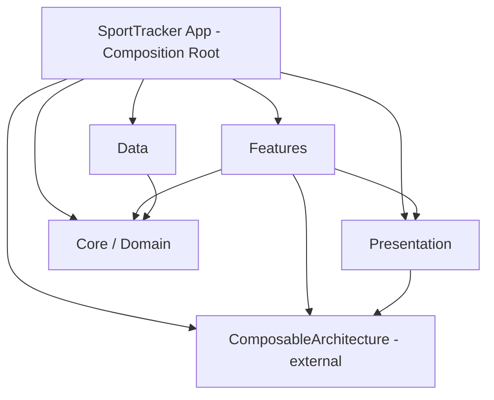

# Architecture Decisions

I wrote this to walk through the reasoning behind the key technical choices in SportTracker.
It is aimed at developers reviewing the codebase as part of the hiring process.

---

## Table of Contents

1. [TCA and Dependency Inversion](#1-tca-and-dependency-inversion)
2. [Module Architecture](#2-module-architecture)
3. [Accessibility](#3-accessibility)
4. [SwiftData over CoreData](#4-swiftdata-over-coredata)
5. [swift-dependencies](#5-swift-dependencies)
6. [XcodeGen](#6-xcodegen)

---

## 1. TCA and Dependency Inversion

### What TCA provides

I went with [The Composable Architecture](https://github.com/pointfreeco/swift-composable-architecture) (TCA) because it enforces unidirectional data flow. Every screen is a `Reducer` + `View` pair where:

- **State** is a plain value type that holds everything the view needs.
- **Action** is an enum describing every event the feature can receive.
- **Reducer** is a pure function `(inout State, Action) -> Effect<Action>` that contains all business logic.
- **Effect** represents side effects (network calls, persistence) that feed results back as new actions.

The view reads state and sends actions — it never mutates state directly.

### Why it suits mobile development

| Benefit | How TCA delivers it |
|---|---|
| Single source of truth | State is one value type; no scattered `@Published` properties or multiple observation chains. |
| Exhaustive testing | `TestStore` forces you to assert every state change and every received action, catching regressions automatically. |
| Controlled side effects | Effects are returned from the reducer, making them visible, testable, and cancellable. |
| Composable navigation | Built-in tools (`StackState`, `@Presents`, `ifLet`, `forEach`) handle push/sheet/alert navigation inside the reducer. |
| Consistent team patterns | Every feature follows the same structure, reducing onbording time and code-review friction. |

### Walkthrough: Filter feature

I'll use the filter screen to walk through the core TCA patterns used throughout the project.

#### Reducer composition

The `body` property composes smaller reducers before the main `Reduce` block runs:

```swift
// Packages/Features/Sources/SportRecordsFeature/Filter/SportRecordsFilterFeature.swift

@Reducer
public struct SportRecordsFilterFeature: Sendable {
    public var body: some ReducerOf<Self> {
        BindingReducer()                                          // 1

        Scope(state: \.sourceSection, action: \.sourceSection) {  // 2
            SelectSectionFeature()
        }

        Reduce { state, action in                                 // 3
            switch action {
            case .sourceSection(.delegate(.selectionChanged(let ids))):
                onSourceSelectionChanged(&state, ids: ids)
            case .categoryTapped(let category):
                onCategoryTapped(&state, category: category)
            // ...
            }
        }
    }
}
```

1. `BindingReducer` intercepts SwiftUI `$store` bindings (e.g. sort picker, search text) and applies state mutations before the main reducer runs.
2. `Scope` delegates child state/actions to `SelectSectionFeature`, a reusable component from the Presentation package. The source section uses this list-based approach, while the category section uses a simpler `categoryTapped` action with a chip-based `FlowLayout` in the view.
3. `Reduce` handles domain-specific logic. Child features communicate upward through `delegate` actions.

#### State and actions

```swift
// State — a plain value type annotated for SwiftUI observation
@ObservableState
public struct State: Equatable, Sendable {
    public var filter: SportRecordFilter
    public var sort: SportRecordSort
    public var sourceSection: SelectSectionFeature.State
}

// Actions — every possible event, including child actions and delegation
@CasePathable
public enum Action: Sendable, BindableAction {
    case binding(BindingAction<State>)
    case sourceSection(SelectSectionFeature.Action)
    case categoryTapped(SportCategory)
    case onApplyTapped
    case onDismissTapped
    case onResetTapped
    case sortTapped(SportRecordSort)
    case delegate(Delegate)

    @CasePathable
    public enum Delegate: Sendable {
        case apply
        case dismiss
        case reset
    }
}
```

The `Delegate` enum is a convention I follow throughout the project: child features emit delegate actions instead of reaching into parent state. The parent (coordinator) decides what to do with them.

### Dependency inversion

The way I set this up, features depend on **protocol-like client structs**, not concrete implementations. This keeps the feature modules free of any Data or Networking imports.

**Interface** — lives in the Feature module:

```swift
// Packages/Features/Sources/SportRecordsFeature/Client/SportRecordsClient.swift

@DependencyClient
public struct SportRecordsClient: Sendable {
    public var fetchAll: @Sendable () async throws -> SportRecordFetchResult
    public var add: @Sendable (SportRecord) async throws -> Void
    public var delete: @Sendable (SportRecord) async throws -> Void
}

extension SportRecordsClient: TestDependencyKey {
    public static let testValue = SportRecordsClient() // auto-generated stubs
}
```

**Live wiring** — lives in the App target (composition root):

```swift
// SportTracker/CompositionRoot/SportRecordsClientLive.swift

extension SportRecordsClient: @retroactive DependencyKey {
    public static var liveValue: SportRecordsClient {
        // Wire SwiftData + Supabase into a repository,
        // then wrap it in closures:
        SportRecordsClient(
            fetchAll: { try await repository.fetchAll() },
            add:      { try await repository.add($0) },
            delete:   { try await repository.delete($0) }
        )
    }
}
```

The feature reducer consumes the client through a single line:

```swift
@Dependency(\.sportRecordsClient) private var client
```

This means:
- Feature modules compile without Data/Networking.
- Tests get auto-generated stubs — no manual mocking.
- Swapping implementations (e.g. in-memory for previews) is a one-line change.

### Testing with TestStore

TCA's `TestStore` requires exhaustive assertions. Every state mutation and every received action must be accounted for, which catches regressions that conventional unit tests miss.

```swift
// Packages/Features/Tests/SportRecordsFeatureTests/SportRecordsFilterFeatureTests.swift

func testSelectCategory() async {
    let store = TestStore(
        initialState: SportRecordsFilterFeature.State(filter: .init(categories: [])),
        reducer: SportRecordsFilterFeature.init
    )

    await store.send(.categoryTapped(.running)) { state in
        state.filter.categories = [.running]
    }
}
```

For features with dependencies, stubs are injected inline:

```swift
let store = TestStore(
    initialState: SportRecordsListFeature.State(),
    reducer: SportRecordsListFeature.init
) {
    $0.sportRecordsClient.fetchAll = {
        SportRecordFetchResult(records: [/* ... */])
    }
}
```

### TCA vs purely native approach

The obvious alternative I considered was vanilla SwiftUI with `@Observable` view models, `async/await` for effects, and manual dependency injection (e.g. environment objects or constructor injection).

| | TCA | Native (Observable + SwiftUI) |
|---|---|---|
| **Testing** | Exhaustive state assertions via `TestStore` | Standard XCTest; must manually assert state properties |
| **Navigation** | Reducer-driven (`StackState`, `@Presents`) — state is always in sync | SwiftUI-driven (`NavigationStack`, `.sheet`) — less centralized control |
| **Side effects** | Explicit `Effect` return type; cancellable, composable | Implicit `Task` blocks in view models; cancellation requires manual tracking |
| **Boilerplate** | More ceremony per feature, but it pays off in consistency | Lower — a view model class is often enough |
| **Learning curve** | Steep at first, but the macros help once you get used to them | Gentle — standard Apple patterns |
| **Third-party risk** | Point-Free ships updates regularly and the community is large enough that I'm not worried | Zero external dependencies |

**Bottom line:** TCA adds upfront cost, but I think the stronger guarantees around testability, navigation correctness, and team consistency are worth it — especially for a PoC where I want to show engineering discipline.

---

## 2. Module Architecture

### Dependency graph



Arrows represent compile-time dependencies. The key rule: **arrows always point inward** — Features and Data depend on Core, never the other way around. The App target is the only module that sees everything.

### Package breakdown

| Package | Targets | Responsibility |
|---|---|---|
| **Core** | `Domain` | Value types (`SportRecord`, `SportCategory`, `RecordSource`), repository protocols, filter/sort models. Zero external dependencies. |
| **Data** | `Networking`, `DataKit` | `Networking`: API client protocol, `URLSession` implementation, Supabase DTOs and remote data source. `DataKit`: SwiftData stack, local data source, repository implementation that merges local + remote. |
| **Presentation** | `SharedUI`, `SharedFeatures` | `SharedUI`: design tokens (theme, colors, typography), reusable components (`AppSection`, `AppLoadingOverlay`, `EmptyStateView`). `SharedFeatures`: reusable TCA features (`SelectSectionFeature`). |
| **Features** | `SportRecordsFeature`, `SettingsFeature` | Screen-level reducers and views. Each feature defines its own `@DependencyClient` interface. |

### Data flow

A typical user interaction flows through these layers:

```
User taps "Add" → View sends Action → Reducer processes logic
    → returns Effect calling SportRecordsClient.add()
        → (in live app) delegates to SportRecordRepositoryImpl
            → routes to SwiftDataLocalDataSource or SupabaseRemoteSportRecordDataSource
                → result flows back as a new Action
                    → Reducer updates State → View re-renders
```

### Navigation coordination

Navigation is centralized in `SportRecordsCoordinatorFeature`. Child features never navigate themselves — they emit delegate actions, and the coordinator decides how to respond:

| Child action | Coordinator response |
|---|---|
| `sportRecordsList.delegate.showDetail(record)` | Push detail onto `StackState` |
| `sportRecordsList.delegate.showAddRecord` | Present add-record sheet (`@Presents`) |
| `sportRecordsList.delegate.showFilter(filter, sort)` | Present filter sheet (`@Presents`) |
| `addSportRecord.delegate.recordAdded(record)` | Dismiss sheet, append record to list (optimistic) |
| `detail.delegate.recordDeleted(id)` | Remove record from list, pop navigation stack |
| `filter.delegate.apply` | Sync filter/sort to list, dismiss sheet |
| `filter.delegate.dismiss` | Dismiss sheet only (no sync) |
| `filter.delegate.reset` | Clear filter/sort to defaults, dismiss sheet |

---

## 3. Accessibility

### Patterns used

I tried to apply accessibility modifiers consistenly across all views. Below are the patterns and where they appear.

#### Labels on icon-only buttons

Every toolbar button that shows only an SF Symbol hides the icon from VoiceOver and provides a localized label:

```swift
// Packages/Features/Sources/SportRecordsFeature/Filter/SportRecordsFilterView.swift

Button {
    dismiss()
} label: {
    Assets.close.image
        .accessibilityHidden(true)
}
.accessibilityLabel("filter.accessibility.close")
```

The same pattern is used for the add-record and filter toolbar buttons in `SportRecordsListView`.

#### Combined accessibility elements

Composite views that contain multiple text elements are merged into a single VoiceOver element with a descriptive label:

```swift
// Packages/Features/Sources/SportRecordsFeature/List/SportRecordTile.swift

.accessibilityElement(children: .combine)
.accessibilityLabel(
    Text(record.category.displayName) +
    Text(": \(record.name)")
)
```

This avoids VoiceOver users having to swipe through each individual text element inside a tile.

#### Selection state via traits

Selectable items communicate their state through the `.isSelected` trait rather than visual-only checkmarks:

```swift
// Packages/Presentation/Sources/SharedUI/Components/SelectItemView.swift

.accessibilityAddTraits(isSelected ? .isSelected : [])
```

The checkmark icon itself is hidden (`.accessibilityHidden(true)`).

#### Section headers and collapsible state

Section headers are marked with the `.isHeader` trait. Collapsible sections additionally report their expanded/collapsed state:

```swift
// Packages/Presentation/Sources/SharedUI/Components/AppSection.swift

.accessibilityAddTraits(.isHeader)
.accessibilityValue(isExpanded ? "accessibility.expanded" : "accessibility.collapsed")
```

#### Hints on destructive actions

Buttons with significant consequences provide hints so VoiceOver users know what will happen:

```swift
// Packages/Features/Sources/SportRecordsFeature/Detail/SportRecordDetailView.swift

.accessibilityHint("records.detail.accessibility.deleteHint")
// "Double tap to permanently delete this record"
```

#### Loading announcements

When the loading overlay appears, it posts a VoiceOver announcement so users are aware the app is working:

```swift
// Packages/Presentation/Sources/SharedUI/Components/AppLoadingOverlay.swift

.accessibilityElement(children: .combine)
.accessibilityLabel("accessibility.loading")
.onAppear {
    UIAccessibility.post(
        notification: .announcement,
        argument: NSLocalizedString("accessibility.loading", comment: "")
    )
}
```

#### Decorative elements

Icons that sit next to text already conveying the same information are hidden from the accessibility tree (`.accessibilityHidden(true)`): category icons in tiles, chevrons in collapsible headers, toolbar button icons with labels.

### Localization

All accessibility strings live in `Localizable.xcstrings` and are translated into both English and Czech. Key strings include:

| Key | English | Purpose |
|---|---|---|
| `records.accessibility.addRecord` | Add Record | Toolbar button label |
| `records.accessibility.filter` | Filter | Toolbar button label |
| `filter.accessibility.close` | Close | Dismiss filter sheet |
| `records.add.accessibility.saveHint` | Double tap to save the new record | Save button hint |
| `records.detail.accessibility.deleteHint` | Double tap to permanently delete this record | Delete button hint |
| `settings.accessibility.openSettingsHint` | Opens the system Settings app to change language | Settings button hint |
| `accessibility.loading` | Loading | Loading overlay label + announcement |
| `accessibility.expanded` / `accessibility.collapsed` | Expanded / Collapsed | Collapsible section state |

### How to test

**VoiceOver (device or simulator)**

1. Enable VoiceOver: Settings > Accessibility > VoiceOver (or triple-click the side button if configured).
2. Navigate the records grid — each tile should read category, name, and duration as one element.
3. Open the filter sheet — verify source/category items announce their selection state.
4. Add a record — the save button should read its hint.
5. View a detail — the delete button should read its hint; collapsible sections should announce expanded/collapsed.

**Accessibility Inspector (Xcode)**

1. Open Xcode > Developer Tools > Accessibility Inspector.
2. Select the simulator as the target.
3. Use the inspection pointer to hover over elements and verify labels, traits, and values match expectations.
4. Run the built-in audit (Audit tab) to catch missing labels or contrast issues.

---

## 4. SwiftData over CoreData

### Why SwiftData is sufficient

The persistence needs here are pretty modest — a single model type (`SportRecordModel`) with straightforward CRUD operations. I went with SwiftData because it handles this with significantly less ceremony than CoreData.

| Aspect | SwiftData | CoreData equivalent |
|---|---|---|
| Schema definition | `@Model` annotation on a Swift class | `.xcdatamodeld` visual editor + generated `NSManagedObject` subclass |
| Uniqueness constraint | `#Unique` macro | `NSMergePolicy` or manual fetch-before-insert |
| Concurrency | `@ModelActor` — actor-isolated context, native `async/await` | `NSManagedObjectContext.perform {}` blocks, `newBackgroundContext()` — more boilerplate to get right |
| Predicate syntax | Swift-native `#Predicate` macro | `NSPredicate` with stringly-typed key paths |
| Container setup | `ModelContainer(for:configurations:)` — 3 lines | `NSPersistentContainer` + coordinator + store description — a fair amount of plumbing for what is essentially a CRUD store |

The local data source implementation shows how concise SwiftData code is:

```swift
// Packages/Data/Sources/DataKit/DataSources/SwiftDataLocalDataSource.swift

@ModelActor
public actor SwiftDataLocalDataSource: LocalSportRecordDataSource {
    public func fetchAll() throws -> [SportRecord] {
        let descriptor = FetchDescriptor<SportRecordModel>(
            sortBy: [SortDescriptor(\.createdAt, order: .reverse)]
        )
        return try modelContext.fetch(descriptor).map { $0.toDomain() }
    }

    public func add(_ record: SportRecord) throws {
        modelContext.insert(SportRecordModel.from(record))
        try modelContext.save()
    }
}
```

The `@ModelActor` macro gives the actor its own `ModelContext` on a background thread. The actor isolation naturally satisfies the `Sendable` requirement of the protocol and makes threading correct by contruction — no `perform {}` blocks needed.

The stack itself is minimal:

```swift
// Packages/Data/Sources/DataKit/DataSources/SwiftDataStack.swift

public final class SwiftDataStack: Sendable {
    public let container: ModelContainer

    public init(for schema: Schema, inMemory: Bool = false) throws {
        let config = ModelConfiguration(isStoredInMemoryOnly: inMemory)
        self.container = try ModelContainer(for: schema, configurations: [config])
    }
}
```

Setting `inMemory: true` gives tests and SwiftUI previews an isolated store with zero setup.

### When CoreData would make more sense

That said, for a production app with more demanding requirements CoreData would still make more sense:

- **Migration tooling** — CoreData's lightweight and heavyweight migration system is mature and well-documented. SwiftData migration support is still evolving.
- **NSFetchedResultsController** — for large, paginated lists with section grouping, `NSFetchedResultsController` provides efficient diffing out of the box.
- **Ecosystem maturity** — edge cases around conflict resolution, iCloud sync, and multi-store configurations are better understood and documented for CoreData.
- **Debugging** — tools like the Core Data instrument and SQLite inspection are well-established.

For this project though, with a single model and straightforward queries, none of that justified the extra complexity.

---

## 5. swift-dependencies

### What it is

[swift-dependencies](https://github.com/pointfreeco/swift-dependencies) is a lightweight dependency injection library by Point-Free. In this project it is resolved transitively through TCA (v1.11.0 in `Package.resolved`), but it is a **standalone package** — it can be adopted without TCA in any Swift project.

The library models DI around a global `DependencyValues` registry, similar in spirit to SwiftUI's `EnvironmentValues`. Dependencies are closure-based structs rather than protocols, which removes the need for manual mock classes in tests.

### Key types used in the project

| Type | Role | Example in codebase |
|---|---|---|
| `@DependencyClient` | Macro that generates a struct with closure properties and unimplemented test stubs. | `SportRecordsClient`, `SettingsClient`, `AppInfoClient` |
| `@Dependency(\.key)` | Property wrapper that reads a dependency from the current context at runtime. | `@Dependency(\.sportRecordsClient) private var client` in reducers |
| `DependencyKey` | Protocol requiring a `liveValue` — the production implementation. | `SportRecordsClient: @retroactive DependencyKey` in App target |
| `TestDependencyKey` | Protocol requiring a `testValue` — the stub used in tests. Auto-satisfied by `@DependencyClient`. | `SportRecordsClient: TestDependencyKey` in Feature module |
| `DependencyValues` | Central registry. Extended with a computed property per client, just like `EnvironmentValues`. | `var sportRecordsClient` extension on `DependencyValues` |
| `withDependencies` | Scoping function that overrides dependencies for a specific closure — used in tests and previews. | `TestStore(…) { $0.sportRecordsClient.fetchAll = { … } }` |

Section 1 already shows the full code for `SportRecordsClient` and its live wiring. The patterns are identical for `SettingsClient` and `AppInfoClient`.

### How native alternatives compare

| Dimension | swift-dependencies | Protocol + constructor injection | SwiftUI `@Environment` |
|---|---|---|---|
| **Testability** | Exhaustive — test fails if an unoverridden dependency is called | Good — inject mocks via init | Limited to views; not usable in plain Swift types |
| **Test isolation** | `withDependencies` scopes overrides per test; no shared mutable state | Natural — each test constructs its own instance | N/A for business logic |
| **Boilerplate** | Low — `@DependencyClient` generates stubs and memberwise init | Medium — protocol + mock class + init parameter per dependency | Low for views, but not applicable to reducers/view models |
| **Compile-time safety** | `DependencyValues` extension catches typos; `@DependencyClient` validates closure signatures | Full — protocol conformance is checked at compile time | Full — `EnvironmentKey` is type-safe |
| **Concurrency** | `Sendable` by design; works with Swift 6 strict concurrency | Depends on implementation | View-bound — limited to `@MainActor` |

### Pros

- **Zero-effort test stubs.** `@DependencyClient` auto-generates unimplemented closures. Tests fail with a clear message if a dependency is called without being overridden — no forgotten mock methods.
- **Scoped overrides.** `withDependencies` ensures each test or preview runs with its own dependency graph. No global mutation, no teardown.
- **Swift 6 concurrency.** All generated types conform to `Sendable`. No extra work to satisfy strict concurrency checking.
- **Uniform pattern.** Every dependency in the project follows the same `@DependencyClient` → `DependencyValues` extension → `DependencyKey` / `TestDependencyKey` structure, regardless of whether it backs a TCA reducer or a plain Swift type.
- **Lightweight.** The package has no dependecies of its own beyond `swift-syntax` (for macros) and `xctest-dynamic-overlay`.

### Cons

- **Third-party dependency.** Actively maintained by Point-Free, but still external. API changes or abandonment would require migration.
- **Implicit resolution.** Dependencies are resolved at runtime from a global registry, unlike constructor injection where every dependency is visible in the init signature. This can make it less obvious what a type requires.
- **Macro debugging.** When `@DependencyClient` produces unexpected code, diagnosing the issue requires expanding macros in Xcode (Editor > Expand Macro), which is less intuitive than reading hand-written protocol conformances.

### Why it fits this project

Since the project already depends on TCA, `swift-dependencies` comes in transitively — there is no additional dependency cost. The closure-based client pattern eliminates mock boilerplate across five test targets, and `withDependencies` scoping keeps tests isolated without teardown logic. I found this trade-off acceptable given the testability benefits.

---

## 6. XcodeGen

### Why XcodeGen

The `.xcodeproj` bundle is generated from a single [`project.yml`](../project.yml) file using [XcodeGen](https://github.com/yonaskolb/XcodeGen). The main motivation is avoiding merge conflicts — `.pbxproj` files are notoriously difficult to merge because Xcode regenerates UUIDs and reorders entries unpredictably. With XcodeGen the project file becomes a derived artifact: conflicts are resolved in the human-readable YAML source, and the `.xcodeproj` is regenerated.

### What `project.yml` defines

| Section | What it controls |
|---|---|
| `options` | Bundle ID prefix, deployment target (iOS 18), Xcode version, directory generation. |
| `settings` | Global build settings — Swift 6, development team. |
| `packages` | Paths to the four local Swift packages (Core, Data, Presentation, Features). |
| `targets.SportTracker` | App target — source paths, dependencies on package products (`SportRecordsFeature`, `SettingsFeature`, `SharedUI`, `Domain`, `DataKit`), and the SwiftLint post-compile script. |
| `targets.SportTrackerTests` | Unit-test bundle — depends on the app target plus package products used in composition-root tests. |
| `schemes` | The single `SportTracker` scheme with build/run/test/profile/archive actions and the `SportTracker.xctestplan` reference. |

### How to regenerate

After editing `project.yml` or changing local package structure:

```bash
xcodegen generate
```

Or use the bootstrap script, which also installs Homebrew dependencies and resolves SPM packages:

```bash
./scripts/bootstrap.sh
```

### Trade-offs vs a committed-only `.xcodeproj`

| | XcodeGen | Committed `.xcodeproj` only |
|---|---|---|
| **Merge conflicts** | Rare — YAML is line-based and easy to diff | Frequent — `.pbxproj` UUIDs cause noisy, hard-to-resolve conflicts |
| **Source of truth** | `project.yml` — declarative and reviewable | The `.xcodeproj` bundle itself — changes are opaque in diffs |
| **Onboarding** | Requires `brew install xcodegen` (or `brew bundle`) | Clone and open — zero extra tooling |
| **CI** | Needs a generate step before building | Ready to build immediately |
| **Xcode UI changes** | Must be reflected back in `project.yml`; accidental Xcode-only edits are lost on next generate | Persisted automatically |

The `.xcodeproj` is committed to the repo so that `clone → open` works without any extra tooling. Developers who modify targets, build settings, or scheme configuration should edit `project.yml` and regenerate.
